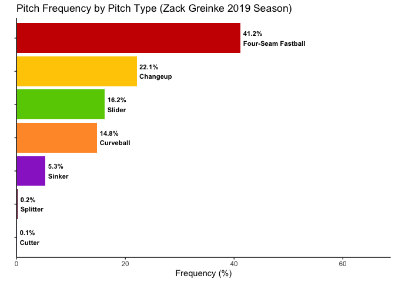
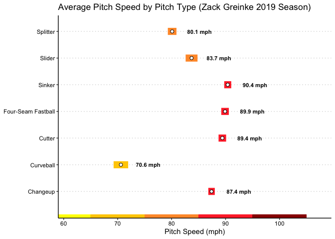
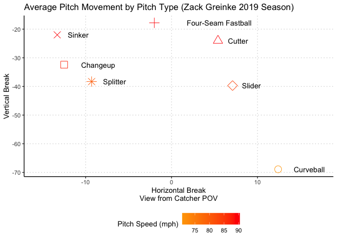

[Link to App](https://ty-benz.shinyapps.io/PitchData/)

## Introduction and Background: 

Sabermetric research, or the empirical analysis of baseball statistics that measure in-game activity, has risen in popularity and usage in recent years in Major League Baseball. Throughout the development of this empirical data collection practice, the information and insights provided have proven extremely valuable and effective for MLB hitters, pitchers, and position players alike. As of the current MLB season, every Major League team has a data analytics department to conduct individualized and proprietary statistical studies. In the case of Major League pitching, being able to understand and visualize how hard a pitcher is throwing, what pitches they are throwing, and where the pitches are moving around home plate is a useful study for both Major League teams themselves and fans alike. For our project, we were interested in collecting pitch data for all Major League pitchers and building a Shiny app around this sabermetric data. Our guiding research questions were as follows: How can we compare different Major League pitchers across a range of years along a set of specific pitch metrics? What pitch data is most useful (and interesting) to examine?

The pitching data we targeted granted us precise information about pitch velocity (how hard the pitcher is throwing the ball), pitch spin (what kind of pitch it is), and pitch movement (how much the pitch is moving as it approaches the batter at home plate). At its core, baseball is a game of small, minute adjustments that comprise an effective approach to pitching, hitting, or fielding. It is of note to analyze how pitchers are throwing their pitches—and also how this has changed over the years—in order to understand what Major League batters are facing and why dominant pitchers are so effective. As baseball fans, our Shiny app allows us to look at our favorite pitchers from our favorite teams and understand exactly what they are doing to produce positive results. The game of baseball has progressed profoundly over the past twenty years, and a large part of this has been the level and precision of pitching. Our data allows us to quantify and visualize this. 

## Data collection: 

When looking for pitch data for our project, the first place we searched was Baseball Savant. Baseball Savant is a website containing every type of baseball statistic you could imagine. The metrics were collected using Statcast technology. Statcast is a tracking technology that is installed in all 30 MLB stadiums located in the US and Canada. Statcast collects data using high-resolution optical cameras and radar equipment. It tracks several measurements including pitch movement and velocity of pitches. The type of pitch is also recorded. 

A fastball is any ball that is the pitcher's fastest pitch and typically exhibits high amounts of backspin on the ball as it travels towards the plate. There are variations of the fastball, including 4-seam fastball, 2-seam fastball/sinker, and cutter. The 4-seam fastball is the original fastball that every pitcher learned to throw first. It typically has the truest backspin and is the straightest of the fastballs, meaning it usually has the lowest horizontal movement (closest to 0) and the highest (least negative) vertical break. A 2-seam fastball/sinker is a fastball that typically has the most side-spin on the ball. This means that it typically has the most horizontal break in the direction of the pitcher’s arm side (it moves negatively for a righty and positively for a lefty in our graph) and lower amounts of vertical break. There is a slight distinction between a 2-seam and sinker, but in our data we put them in the same category as a sinker because the pitches have similar profiles. A 2-seam typically has slightly higher vertical break than a sinker and would have higher spin if you were looking at spin rate (measured in revolutions per minute). The final fastball is a cutter. This pitch is the opposite of a sinker as it is a fastball that moves towards the pitcher's glove side. This pitch has average vertical break for a fastball, but has above average horizontal break in the positive direction for right handed pitchers and in the negative direction for left handed pitchers. 

The next pitch type is the change-up, which is classified as a pitch that is similar in spin to a fastball but much slower. There are two different types of change-ups in our data. The first of those is the pitch actually called a change-up. Identified as a pitch with lower velocity, vertical break, and spin, the change-up is essentially a slower fastball that has a lower (more negative) vertical break due to the lower spin and speed. The other type of change-up is a splitter. This pitch is notoriously difficult to throw as a pitcher splits their pointer and index fingers all the way around the ball, essentially splitting the ball in half with their fingers. It has extremely low spin due to the way it comes out of the hand and can even be a bit unpredictable in the direction of break based on how the pitcher's wrist is oriented while the ball is being released. However, the pitch typically has very low vertical break and average horizontal break. It can be thrown very hard (like 3-5 mph slower than the pitcher’s fastball) or very slowly (10-15 mph slower than the pitcher’s fastball). 
Next, we have the breaking pitches, of which there are two different varieties. The first variety is the curveball. This was the first breaking pitch discovered and is identified by the topsin it has. This topsin makes the curveball have very low vertical break, meaning it breaks a lot in the negative direction. Some pitchers throw a true 12-6 (think hands on a clock) curveball meaning it is almost exclusively vertical break and almost no horizontal break. Others throw more of a hybrid between a slider and a curveball, which still has very low vertical break, but has very high horizontal break towards the pitcher’s glove side. The other breaking ball is the aforementioned slider. This pitch is almost always thrown pretty hard and has less overall movement. It spins like a bullet on the way to the plate, meaning it has almost no horizontal or vertical break when thrown correctly. 

Lastly, we have the knuckleball. This is by far the oddest pitch in baseball. The pitcher that throws it has no idea what it will do, meaning that it can be either unhittable or the easiest pitch to hit. It is thrown by digging your fingernails into the seams on the baseball and trying to throw the ball with as little spin as possible. The ball will wobble uncontrollably through the air on the way to the plate, meaning that it is impossible to predict horizontal or vertical break. Typically, it is thrown slowly so it will have very low vertical break and an unpredictable amount of horizontal break. 
We were inspired to look at pitch movement based on a project Ty previously did in his Introduction to Statistical Modeling class. We used his dataset as a base data set to test and see if the idea would be feasible for our final project. Once we realized that the data would work, we went to Baseball Savant to gather more data to expand the dataset. We selected all of the pitch data, which included horizontal and vertical pitch movement, average pitch velocity, and range of velocities for each pitch. All of the data was sorted by pitcher, and we included every year since 2016 since that was the first year every MLB ballpark had Statcast installed to track pitch movement accurately during games. We verified that all of the pitchers had over 50 plate appearances so the data wouldn’t be skewed from a small sample size. A plate appearance is any time a batter steps to the plate and an outcome is reached, meaning the batter either got out or got on base. Then we downloaded the csv files for each of the 5 seasons we wanted to include.

We had to read in the csv files and change almost every column to a numeric value, in addition to skipping a row and a column to remove blank space in each csv. From there, we binded all of the rows together to give us the initial combined data frame. However, we quickly realized the formatting of the current data frame was not conducive to the graphs we wanted to create. We wanted to graph the average pitch velocity, velocity range, pitch frequency, and vertical and horizontal movement by pitcher and year for each pitch type. In order to achieve this, we needed to have single columns for pitch type, average pitch velocity, velocity range, pitch frequency, horizontal movement, and vertical movement. The original format of the data frame had separate columns for each metric for each pitch with no column for pitch type. For example, instead of one column containing all average pitch velocities, there were multiple columns labeled for four-seam fastball average velocity, changeup average velocity, curveball average velocity, etc.

We wrangled the data by creating individual datasets for each pitch type, including all of the metrics for each pitcher for each year. Then we added a column labeled pitch type and assigned the value to be the name of the pitch. For example, in the four-seam fastball dataset, all of the pitches were assigned the value “Four-Seam Fastball” for pitch type. We then removed the pitch type designation from the other pitch metrics. Once this process was completed for each pitch type, we binded the rows together for each pitch type dataset to create one finalized dataset to use for our graphs.

## App User Manual and Graph Analysis: 

Our shiny app works as a series of selections that displays the data you want on a plot. First you must select the pitcher unless you want to look at the default pitcher. You can do this by either scrolling through the drop down or you can type to search for a specific player. When you select a pitcher, the years he pitched are automatically updated in the year selector. Once you select one of the years the pitcher pitched, you can choose which graph you want to see. The graph is displayed the second all three selections are filled with acceptable values. It also will dynamically update the plot if you change the pitcher or the year and bring up the new statistics on the plot in addition to changing the plot if you want to see different data for the same pitcher. We tried to make the shiny app as straightforward to use as possible so there will not be much explanation needed for a new user. 

The graph titled “Pitch Frequency by Pitch Type” is a bar chart visualization that depicts the frequency that each pitcher threw each pitch in his pitch arsenal over a given season. This is informative because it shows which pitches a pitcher throws and how often. This allows baseball fans to see how their favorite team’s pitchers develop new tools over time or coaches and players to prepare to face a certain pitch. For example, in 2019 Zack Greinke threw both a Splitter and Cutter, but he threw both less than 1% of his total pitches that season. Furthermore, he did not throw them at all in 2020 or 2021. Therefore, a team preparing to face Greinke in the 2022 season would not expect him to throw those pitches and would instead prepare for him to throw primarily four-seam fastballs and changeups, his two highest frequency pitches for the last 3 seasons.

The graph titled “Average Speed by Pitch Type” is a visualization allowing a person to compare the different average speeds in miles per hour of each pitch type a pitcher may throw. It also depicts the overall range in the speed of each pitch type. This information can be interesting to baseball fans, coaches, and players. Baseball fans may be interested to see how a player’s pitch arsenal and average pitch speeds have changed over time. For example, Clayton Kershaw average velocity of his four-seam fastball has decreased since 2016. However, Jacob deGrom’s average four-seam fastball velocity has increased by almost 6 mph since 2016. Coaches and players can use this information to inform their pregame hitting workouts. For example, if a pitcher throws primarily high speed pitches then players may want to practice hitting high speed pitches. If a pitcher throws several pitches that vary greatly in speed, then a player may prepare to face him by practicing hitting pitches that drastically vary in speed from each other. If a team was expecting to face a pitcher like Fernando Abad whose average pitch speeds for his different pitches has an overall range of close to 20 mph, then coaches help their hitters prepare by changing pitch speeds frequently during hitting workouts. This information can be increasingly informative when combined with our additional visualizations looking at pitch frequency and pitch movement.

The graph titled “Pitch Movement by Pitch Type” is a useful visualization of the trajectory of the ball for each specific pitch a pitcher throws. The point on the graph shows where the pitch crosses home plate and is presented from the point of view of the catcher, so the x-axis (horizontal break) has negative and positive values to demonstrate which direction the ball is moving. Negative values (measured in inches) indicate the ball is breaking towards the left side of the field (as viewed from the catcher’s point of view) and positive values indicate the ball is breaking towards the right side. For a right-handed batter, negative horizontal break means the ball will be moving in towards them (known as an inside pitch), while positive horizontal break means the ball will move away from them across the plate (known as an outside pitch). For Major League batters, knowing where a pitch is moving is extremely helpful in preparing to hit off of a specific pitcher. If the batter knows that a certain pitcher’s curveball is breaking towards the outside of the plate, they can stand closer to the plate to give them more coverage and a better chance of hitting it. For fans, it is a cool metric to compare their favorite pitcher’s pitch movements between the years. For example, Los Angeles Dodgers ace Clayton Kershaw’s pitch movement has changed slightly from 2016 to 2021. His four-seam fastball, slider, and curveball have moved to the left along the horizontal break axis over the years, meaning that in 2021 he is throwing pitches that are breaking to the left (more inside on right-handed batters and outside on left-handed batters) more than he was in 2016. 

Combining the information gathered from these three visualizations can also be informative for a player planning their strategic approach to facing a certain pitcher. For example, in 2021, Fernando Abad threw his sinker, his fastest pitch, 47.2% of the time. His second most frequently thrown pitch at 26.1% was his curveball, thrown about 15 mph slower than his sinker. Furthermore, his sinker finishes up and inside on a right handed batter, and his curveball finishes low and outside on a right handed batter. Therefore, if I was a hitter facing Fernando Abad, my approach would be to look to hit his sinker because I prefer higher velocity inside pitches, and based on his pitch frequency, it is extremely likely he will throw it.

## Example Graphs

The graphs below are shown filtered for Zack Greinke's 2019 Pitch Data. The filter line was removed before adding the graph code to the shiny app code. The app selects the chosen pitcher and year and displays those graphs.

<!-- --><!-- --><!-- -->

